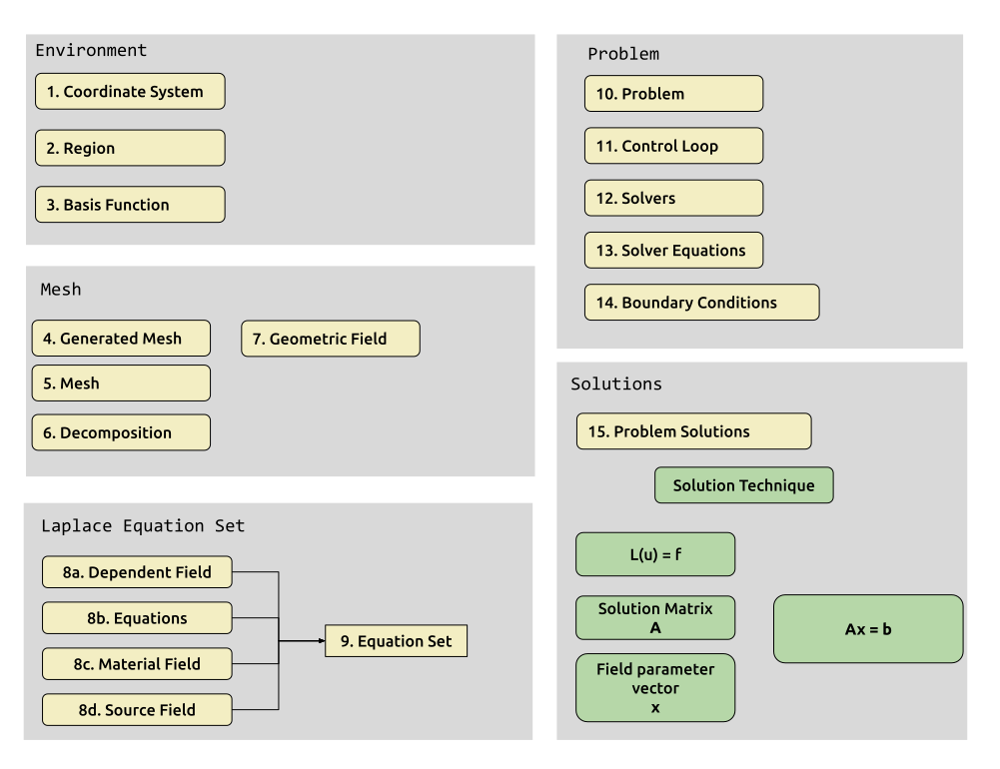
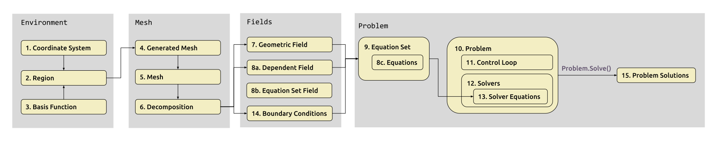

# OpenCMISS-Iron concepts

OpenCMISS-Iron has been developed as a library with object oriented programming in mind. This can be a little confusing for people who are used to working with commercial finite element modelling packages like ANSYS or COMSOL. The best analogy for how to think about using the OpenCMISS-Iron library is that it can be used like C++ libraries. In this section of this basic tutorial we will be covering the basic concepts of OpenCMISS-Iron and how to use its library calls.

## _Languages of OpenCMISS-Iron_
The core library variables, functions and classes of OpenCMISS-Iron have been written using FORTRAN 90. This is to enable effective use of high performance computing resources. However, we have also implemented python and c bindings for the FORTRAN library, which makes it easier for users to incorporate OpenCMISS-Iron functionality into their codes. In this basics tutorial we will be making calls to the OpenCMISS-Iron's Python-bindings API to illustrate how we can interact the library, while at the same time demonstrating the functionalities of OpenCMISS-Iron.

## Putting concepts into the Laplace Problem context
The OpenCMISS-Iron libraries have been created to enable highly advanced computational modelling of biological systems. It represents a re-engineering of over 30 years' of legacy codes for finite element based computational modelling of biological systems under the mast of the Physiome Project. Therefore, to fully appreciate and utilise the features of OpenCMISS-Iron, we recommend familiarising yourself with the fundamental concepts and data structures of OpenCMISS-Iron. This tutorial is a first step towards acquiring this understanding.

In this tutorial we will be developing a basic python finite element modeling program to solve the Laplace equation over a two-dimensional domain using the OpenCMISS-Iron library functionality. Lets define the problem we are going to solve here so that you can see how concepts we are going to introduce will be applied in this context.

**Coordinate system:** 2D rectangular cartesian 

**Basis function scheme:** Bilinear Lagrange interpolation scheme (TODO add link to latest ABI theory documentation).

**2D Domain:** A square domain of unit size (1.0 X 1.0). 

**Number of elements:** 1 element along the x-direction and 3 elements along the y-direction. 

**Equation to solve**: $\nabla^2 u = 0$ (TODO add link to Wikipedia laplace)

**Initial value of the dependent field, u:** 0.5

**Boundary conditions:** Node number 1 and 8 have dirchlet boundary conditions associated with them: u = 0.0 at node 1 and u = 1.0 at node 8. 

## OpenCMISS-Iron is designed for object-oriented programming
Now that the Laplace problem has been defined lets delve into how this problem can be defined with OpenCMISS-Iron. OpenCMISS-Iron has been developed with object-oriented programming in mind. The figure below shows the workflow and steps involved in defining our Laplace problem. Each box represents an object that is created from a class defined in OpenCMISS-Iron. These objects when grouped as shown help us define the Laplace problem that we have defined for this tutorial. 

<!--
[comment]: <> (Switch to relative path instead of global path when built in Github)

-->

Initialise OpenCMISS
1. System setup
2. Coordinate System Objects
3. Region Objects
4. Basis Objects
5. Generated Mesh Objects
6. Mesh Objects
7. Decomposition Objects
8. Field Objects
9. Equations Sets
  a. Dependent Field
  b. (Materials Field, Source Field, etc.)
  c. Equations
10. Problems
11. Control Loops
12. Solvers
13. Solver Equations
14. Boundary Conditions
15. Problem Solution
16. Export of Solution
Finalize OpenCMISS

<!--

-->
